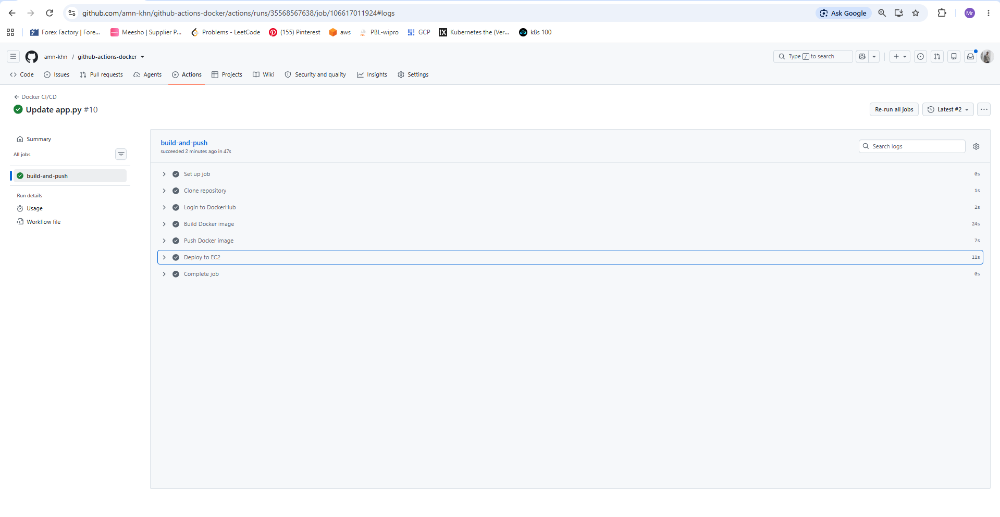
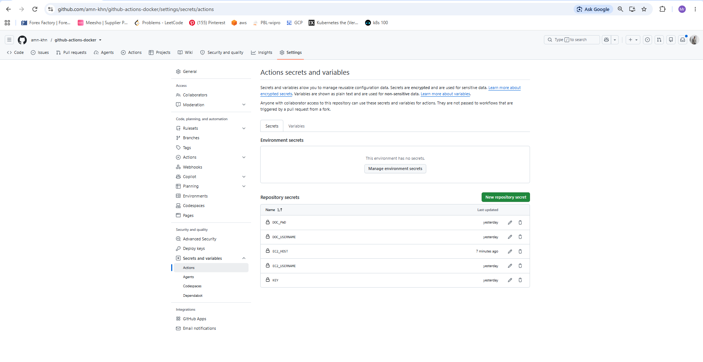
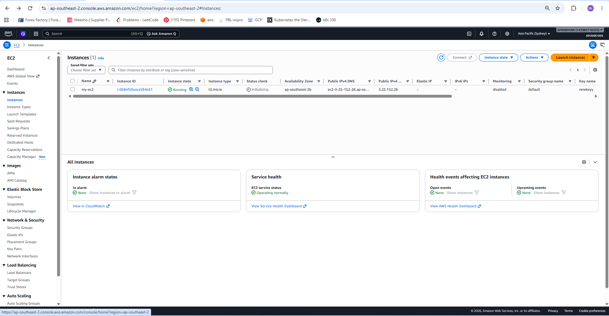
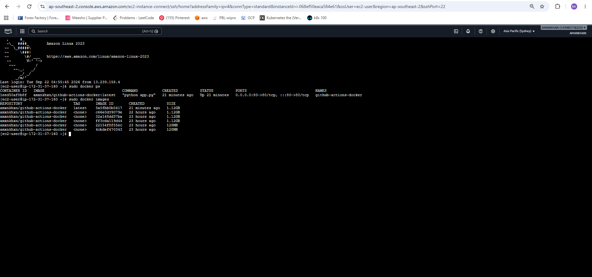
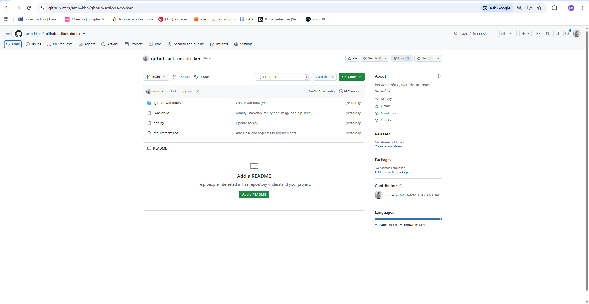
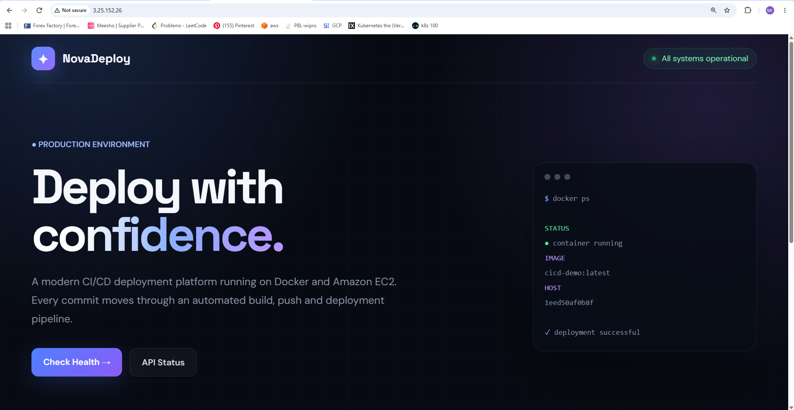
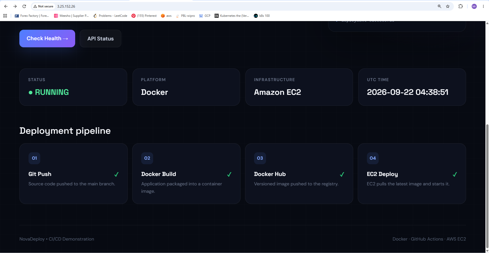

# 🚀 GitHub Actions CI/CD Pipeline with Docker & AWS EC2

A complete CI/CD pipeline built using **GitHub Actions**, **Docker**, and **AWS EC2 Self-Hosted Runner**. Every push to the `main` branch automatically builds a Docker image, pushes it to Docker Hub, and deploys the latest container on an EC2 instance.


---

# 📌 Project Overview

This project demonstrates an end-to-end CI/CD workflow.

## ✅ What this project does

- Push code to GitHub.
- GitHub Actions workflow triggers automatically.
- Docker image is built.
- Image is pushed to Docker Hub.
- EC2 Self-Hosted Runner pulls the latest image.
- Existing container is removed.
- New container is deployed automatically.

---

# 🏗️ Architecture



---

# ⚙️ Tech Stack

| Technology | Purpose |
|------------|---------|
| GitHub Actions | CI/CD Automation |
| Docker | Containerization |
| Docker Hub | Image Registry |
| AWS EC2 | Deployment Server |
| Self-Hosted Runner | Executes deployment jobs |
| Python (Flask) | Demo Application |

---

# 📂 Project Structure

```text
github-actions-CI-CD/
│── screenshots/
│   ├── workflow.png
│   ├── ec2-instance.png
│   ├── secrets.png
│   ├── ssh.png
│   ├── files.png
│   ├── output1.png
│   └── output2.png
│
│── .github/workflows/workflow.yml
│── Dockerfile
│── app.py
│── requirements.txt
│── README.md
```

---

# 🔄 CI/CD Workflow

1. Developer pushes code to `main`.
2. GitHub Actions starts workflow.
3. Docker image is built.
4. Image is pushed to Docker Hub.
5. EC2 runner pulls latest image.
6. Old container stops.
7. New container runs automatically.

---

# 🔐 GitHub Secrets

Store these secrets inside GitHub Repository → **Settings → Secrets and Variables → Actions**.

### Screenshot



### Secrets Used

| Secret | Purpose |
|--------|---------|
| DOCKER_USERNAME | Docker Hub Username |
| DOC_PWD | Docker Hub Password/Token |
| EC2_HOST | EC2 Public IP |
| EC2_USER | ubuntu/ec2-user |
| EC2_SSH_KEY | Private SSH Key |

---

# 🐳 Docker Configuration

Docker packages the application into a portable container.

- Creates image.
- Runs Flask application.
- Exposes application on port **5000**.

---

# ☁️ AWS EC2 Deployment

Application is hosted on an EC2 instance using Docker.

### EC2 Instance



### SSH Connection



---

# 📁 GitHub Repository Files

Repository structure used in this project.



---

# ▶️ Workflow Execution Result

GitHub Actions completed successfully.

### Workflow Output



### Docker Deployment Output



---

# 🚀 How to Run This Project

### Clone Repository

```bash
git clone https://github.com/amn-khn/github-actions-CI-CD.git
cd github-actions-CI-CD
```

### Build Docker Image

```bash
docker build -t flask-app .
```

### Run Container

```bash
docker run -d -p 5000:5000 flask-app
```

Visit:

```text
http://<EC2-PUBLIC-IP>:5000
```

---

# 💡 Why GitHub Actions?

- Automatic deployment.
- No manual Docker commands after every change.
- Faster delivery.
- Consistent deployments.
- Easy rollback with Docker images.

---

# 📚 Learning Outcomes

- GitHub Actions Workflow.
- Docker Image Build & Push.
- Docker Hub Integration.
- AWS EC2 Deployment.
- Self-Hosted Runner Setup.
- Automated CI/CD Pipeline.

---

# 👨‍💻 Author

**MOHAMMED AMANKHAN**

- GitHub: https://github.com/amn-khn
- LinkedIn: https://linkedin.com/in/mohammed-amankhan

⭐ If this project helped you, don't forget to Star this repository.
